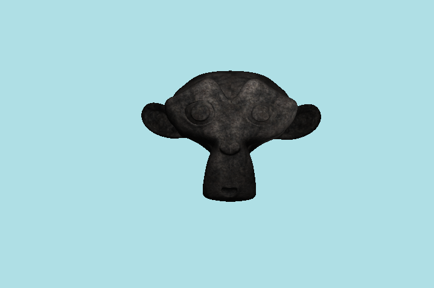
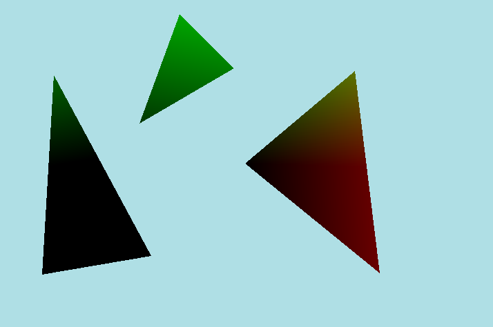
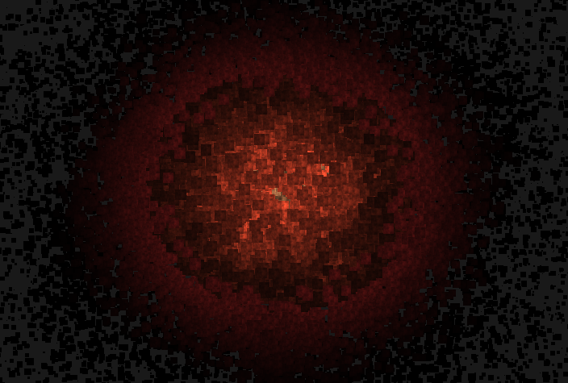
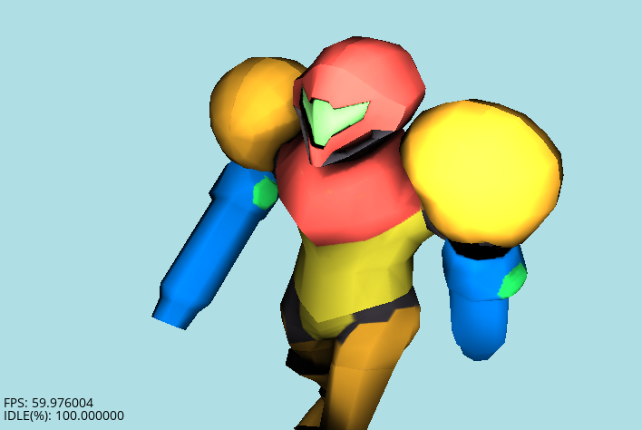
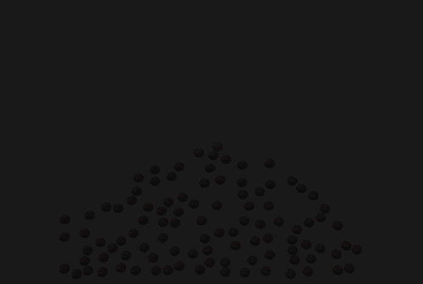
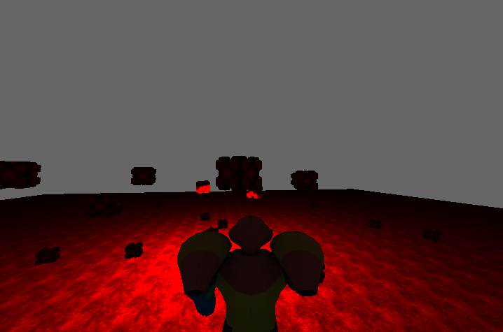
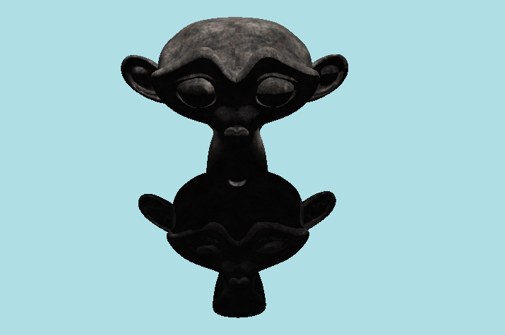

# MGL
## Repository for the Minimal Graphics Library

### Building

Welcome to the Minimal Graphics Library! This is the prerelease alpha version 0.1.

This package is the source code distribution of the Minimal Graphics Library, hence abbreviated MGL. The library builds on linux and win32 platforms. 
A GNU makefile is available for compilation with GCC/MINGW for win32 platforms or GCC/X11 for linux platforms. 
The makefile should work for both environments without modification.

The GNU makefile contains various build targets.
- 'make' - builds all tests and examples.
- 'make benchmarks' - builds only benchmarks (gl_bench)
- 'make examples' - builds only examples (ex1-ex9)
- 'make tests' - builds only tests (gl_test, wl_test)
- 'make lib' - builds a static library (libmin.a)
- 'make clean' - cleans up all generated output files

These build targets have been tested for compilation on Arch Linux x64 and Windows 7 (x86,x64) platforms.

### Dependencies

#### GLEW

GLEW is used within the engine for adding OpenGL function support.
No configuration is necessary, but you can find further information about GLEW at http://glew.sourceforge.net/.

#### OPENAL

OPENAL is used for adding sound capabilities and requires installing the installer from Creative Labs Inc at https://www.openal.org/.
OpenAL-Soft can also be used for providing a software renderer. OpenAL-Soft can be downloaded at http://kcat.strangesoft.net/openal.html.

#### Platform Specific

Additional dependencies that are required and not distributed in this package include:
- 'g++-5.4' - all platforms
- 'opengl3.3+' - all platforms
- 'openal' - all platforms
- 'libvorbis' - all platforms
- 'openal-soft' - for linux only
- 'mingw32' - for win32 only
- 'freetype' - for win32 and linux
- 'X11' - for linux only

#### Arch Linux Users

For Arch Linux users, the following pacman command should install all needed dependencies:
- pacman -S freetype2 xorg-server xorg-server-devel openal libvorbis

To verify freetype has been installed properly, query it using the following command:
- freetype-config --cflags

#### Code Formatting

To perform code formatting, run the formatting script command in the project root (clang is required):
- ./format

### Compile Flags

An alternative VBO mode can be enabled by exporting a variable to bash before compiling with the makefile. 
This mode allows faster vertex_buffer.bind_buffer() switching because it uses OpenGL 4.3 features to separate VBO specification from within VAO state.
This mode requires using a OpenGL 4.3 core profile.
- 'export MGL_VB43=true'

### Usage

After building the project tests and examples, you can run any example from the project root directory.
- Running examples 'bin/ex<1-9>'

All examples assume that the current working directory is the project root directory.

In order to link with the static library all template classes should be declared with 'extern template class' to prevent the automatic instantiation of members.

#### Example 1

To run this project execute the command 'bin/ex1' in the project root directory. 
The example will load a textured mesh and rotate it on the screen.

Commands
- 'MOUSE' move camera
- 'Q' will exit the example.

#### Example 2
This example is a texture compressor that will create DDS files using the GPU to perform DDS compression. 
- Usage definition: 'bin/ex2 <uncompressed.bmp> -o <compressed.dds> -t <compression_type> -m <bool>'
- <uncompressed.bmp>: File that will serve as input, BMP only.
- <compressed.dds>  : File that will serve as output, DDS only.
- <compression_type>: DXT1, DXT3, DXT5 compression types
- <bool>            : Generate mipmap flag | (true,false)

Usage example:   'bin/ex2 infile.bmp -o outfile.dds -t DTX1 -m false'
This will convert a BMP image into a DXT1 DDS file without generating mipmaps.

#### Example 3

To run this project execute the command 'bin/ex3' in the project root directory. 
The example will record mouse clicks to the output log and draw CW triangles on the screen.

Commands
- 'Q' will exit the example.

#### Example 4

To run this project execute the command 'bin/ex4' in the project root directory. 
The example will render an animated particle system and allow switching force applicators using the RETURN key.

Commands
- 'ENTER' to change force applicators
- 'Q' will exit the example.

#### Example 5

To run this project execute the command 'bin/ex5' in the project root directory. 
The example will render an animated MD5 model and allow looking around the viewport using the mouse.

Commands
- 'Q' will exit the example.

#### Example 6-8

To run these projects execute the command 'bin/ex6', 'bin/ex7', or 'bin/ex8' in the project root directory. 
The example will render an animated physics simulation using spheres, aabb, or oobb geometries.

Commands
- 'Q' will exit the example.

#### Example 9

To run this project execute the command 'bin/ex5' in the project root directory. 
The example will render an animated MD5 model and allow looking around the viewport using the mouse. 
A physics simulation will run and allow dynamic interaction between MD5 player mesh and OOBB physics cubes.

Commands
- 'W' move forward in direction of camera
- 'ENTER' spawn a OOBB physics cube
- 'Q' will exit the example.

#### Example 10

To run this project execute the command 'bin/ex10' in the project root directory. 
The example will load two shadowed meshes, one shadowing the other using a shadow map.

Commands
- 'MOUSE' move camera
- 'Q' will exit the example.
