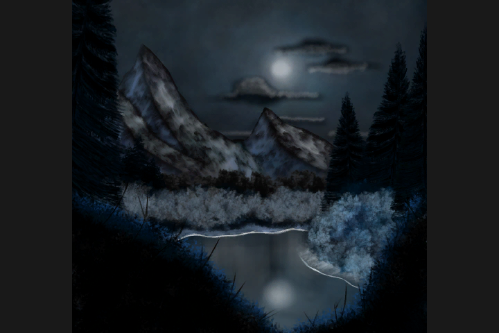

# MGL
## Repository for the Minimal Graphics Library

Welcome to the Minimal Graphics Library! This is the prerelease alpha version 0.1.

This package is the source code distribution of the Minimal Graphics Library, hence abbreviated MGL. The library builds on Linux and Windows platforms. 
A GNU makefile is available for compilation with GCC|CLANG with MINGW for Windows platforms or GCC|CLANG with X11 for Linux platforms. 
The makefile should work for both environments without modification.

### PKGBUILD

If you are running Arch Linux, I have created PKGBUILD's for this project located at https://github.com/Aaron-SP/pkgbuild/blob/master/mgl/PKGBUILD.

### Building

Verify a bin directory exists before compiling with the makefile. 
- 'mkdir -p bin'

### CMake

The CMakeLists.txt file builds all example executables, tests, and benchmarks. Building with CMake has been tested on Cygwin, Unix, and Windows + VCPKG environments.

### CMake + MSVC + VCPKG

Install Build Tools for Visual Studio 2017, if you do not have the MSVC compiler on your system at https://visualstudio.microsoft.com/downloads.

Find the VCPKG library directory
- vcpkg\installed\*-windows

Add the recently found VCPKG library directory to your path so that CMake can find the libraries on the system. Install the required dependencies with VCPKG and make sure to run **'vcpkg integrate install'** to automatically add the include and linker settings to the MSVC build files, since the CMake files do not try to set them for this environment. Use CMake to generate the Visual Studio projects files. 

Then run the following command to build optimized x86 executables.
- msbuild.exe MGL.sln /p:Configuration=Release /p:Platform=Win32

You can modify the arguments to MSBuild as needed based on your own build criteria. The compiled binaries will be placed in project root bin/(Debug|Release) directory. Visual studio places these binaries in a secondary folder 'Debug|Release'. You will need to copy the binaries out of that folder to run properly. You may need to copy glew32.dll from the VCPKG directory to run the executables as it may not have been automatically copied by MSBuild.

### GNU MAKE

The GNU makefile contains various build targets.
- 'make' - builds all tests and examples.
- 'make benchmarks' - builds only benchmarks (gl_bench)
- 'make clean' - cleans up all generated output files
- 'make examples' - builds only examples (ex1-ex10)
- 'make lib' - builds a static library (libmin.a)
- 'make tests' - builds only tests (gl_test, wl_test)
- 'make install' - installs header files into /usr/include/mgl
- 'make uninstall' - removes header files from /usr/include/mgl

These build targets have been tested for compilation on Arch Linux x64 and Windows 7 (x86,x64) platforms.

### Dependencies

#### OPENGL

OpenGL 3.2 is the minimum version required and OpenGL 4.3 is the maximum version required depending on enabled features.

The following OpenGL functions are used for required for rendering. 
- glActiveTexture
- glAttachShader
- glBindBuffer
- glBindBufferBase
- glBindFramebuffer
- glBindTexture
- glBindVertexArray
- glBindVertexBuffer
- glBufferData
- glBufferSubData
- glCheckFramebufferStatus
- glClear
- glClearBufferfv
- glCompileShader
- glCompressedTexImage2D
- glCreateProgram
- glCreateShader
- glDeleteBuffers
- glDeleteFramebuffers
- glDeleteProgram
- glDeleteShader
- glDeleteTextures
- glDeleteVertexArrays
- glDetachShader
- glDisableVertexAttribArray
- glDrawArrays
- glDrawArraysInstanced
- glDrawBuffer
- glDrawElements
- glDrawElementsInstanced
- glEnableVertexAttribArray
- glFramebufferTexture
- glGenBuffers
- glGenerateMipmap
- glGenFramebuffers
- glGenTextures
- glGenVertexArrays
- glGetActiveUniformsiv
- glGetCompressedTexImage
- glGetIntegerv
- glGetProgramInfoLog
- glGetProgramiv
- glGetShaderInfoLog
- glGetShaderiv
- glGetTexLevelParameteriv
- glGetUniformBlockIndex
- glGetUniformIndices
- glGetUniformLocation
- glHint
- glIsProgram
- glIsShader
- glLinkProgram
- glPixelStorei
- glPolygonMode
- glShaderSource
- glTexImage2D
- glTexParameteri
- glTexSubImage2D
- glUniform1i
- glUniform3f
- glUniform4f
- glUniformBlockBinding
- glUseProgram
- glVertexAttribBinding
- glVertexAttribFormat
- glVertexAttribPointer
- glViewport

#### GLEW

GLEW is used within the engine for adding OpenGL function support.
No configuration is necessary, but you can find further information about GLEW at http://glew.sourceforge.net/.

The following GLEW features are required.
- GLEW_ARB_draw_instanced
- GLEW_ARB_explicit_attrib_location
- GLEW_ARB_fragment_program
- GLEW_ARB_framebuffer_object
- GLEW_ARB_framebuffer_sRGB
- GLEW_ARB_fragment_shader
- GLEW_EXT_texture_compression_s3tc
- GLEW_EXT_texture_sRGB
- GLEW_ARB_vertex_array_object
- GLEW_ARB_vertex_attrib_binding
- GLEW_ARB_vertex_buffer_object
- GLEW_ARB_vertex_program
- GLEW_ARB_vertex_shader
- GLEW_ARB_uniform_buffer_object

#### FREETYPE2

You only need this dependency if you wish to use text rendering features (renderer/text_buffer.h).

FREETYPE2 is used for converting TTF fonts into bitmap texture atlases for text rendering.
No configuration is necessary, but you can find further information about FREETYPE2 at https://www.freetype.org.

#### Libvorbis

You only need this dependency if you wish to play OGG files (file/ogg.h).

Libvorbis is used to decompress OGG files for sound playback.
No configuration is necessary, but you can find further information about LIBVORBIS at https://xiph.org/vorbis.

#### OPENAL

You only need this dependency if you wish to use sound playback features (sound/sound_buffer.h).

OPENAL is used for adding sound capabilities and requires installing the installer from Creative Labs Inc at https://www.openal.org.
OpenAL-Soft can also be used for providing a software audio renderer. OpenAL-Soft can be downloaded at http://kcat.strangesoft.net/openal.html.

#### Platform Specific

Additional dependencies that are required and not distributed in this package include:
- 'g++-5.4' - all platforms
- 'opengl3.3+' - all platforms
- 'openal' - all platforms
- 'libvorbis' - all platforms
- 'openal-soft' - for linux only
- 'mingw32' - for windows only
- 'freetype' - for windows and linux
- 'X11' - for linux only

#### Arch/Ubuntu Linux Users

For Arch Linux users, the following pacman command should install all needed dependencies:
- pacman -S base-devel git xorg-server xorg-server-devel glew freetype2 libvorbis openal

For Ubuntu 14.04.1 Linux users, the following apt-get command should install all needed dependencies:
- apt-get install build-essential git libgl1-mesa-dev libglu1-mesa-dev xorg-dev libglew-dev libfreetype6-dev libvorbis-dev libalut-dev

To verify freetype has been installed properly, query it using the following command:
- pkg-config freetype2 --cflags

#### Code Formatting

To perform code formatting, run the formatting script command in the project root (clang is required):
- ./format

### Compile Flags

An alternative VBO mode can be enabled by exporting a variable to bash before compiling with the makefile. 
This mode allows faster vertex_buffer.bind_buffer() switching because it uses OpenGL 4.3 features to separate VBO specification from within VAO state.
This mode requires using a OpenGL 4.3 core profile.
- 'export MGL_VB43=true'

### Usage

After building the project tests and examples, you can run any example from the project root directory.
- Running examples 'bin/ex<1-10>'

All examples assume that the current working directory is the project root directory.

In order to link with the static library all template classes should be declared with 'extern template class' to prevent the automatic instantiation of members.

#### Example 1

To run this project execute the command 'bin/ex1' in the project root directory. 
The example will load a textured mesh and rotate it on the screen.

Commands
- 'MOUSE' move camera
- 'Q' will exit the example.

#### Example 2
This example is a texture compressor that will create DDS files using the GPU to perform DDS compression. 
- Usage definition: 'bin/ex2 <uncompressed.bmp> -o <compressed.dds> -t <compression_type> -m <bool>'
- <uncompressed.bmp>: File that will serve as input, BMP only.
- <compressed.dds>  : File that will serve as output, DDS only.
- <compression_type>: DXT1, DXT3, DXT5 compression types
- <bool>            : Generate mipmap flag | (true,false)

Usage example:   'bin/ex2 infile.bmp -o outfile.dds -t DTX1 -m false'
This will convert a BMP image into a DXT1 DDS file without generating mipmaps.

#### Example 3

To run this project execute the command 'bin/ex3' in the project root directory. 
The example will record mouse clicks to the output log and draw CW triangles on the screen.

Commands
- 'Q' will exit the example.

#### Example 4

To run this project execute the command 'bin/ex4' in the project root directory. 
The example will render an animated particle system and allow switching force applicators using the RETURN key.

Commands
- 'ENTER' to change force applicators
- 'Q' will exit the example.

#### Example 5

To run this project execute the command 'bin/ex5' in the project root directory. 
The example will render an animated MD5 model and allow looking around the viewport using the mouse.

Commands
- 'Q' will exit the example.

#### Example 6-8

To run these projects execute the command 'bin/ex6', 'bin/ex7', or 'bin/ex8' in the project root directory. 
The example will render an animated physics simulation using spheres, aabb, or oobb geometries.

Commands
- 'Q' will exit the example.

#### Example 9

To run this project execute the command 'bin/ex5' in the project root directory. 
The example will render an animated MD5 model and allow looking around the viewport using the mouse. 
A physics simulation will run and allow dynamic interaction between MD5 player mesh and OOBB physics cubes.

Commands
- 'W' move forward in direction of camera
- 'ENTER' spawn a OOBB physics cube
- 'Q' will exit the example.

#### Example 10

To run this project execute the command 'bin/ex10' in the project root directory. 
The example will load two shadowed meshes, one shadowing the other using a shadow map.

Commands
- 'MOUSE' move camera
- 'Q' will exit the example.

#### Example 11

To run this project execute the command 'bin/ex11' in the project root directory. 
The example will load a flat 2D image on the screen. You can override the default image by passing an image path like 'bin/ex11 path/to/image'.

Commands
- 'Q' will exit the example.
